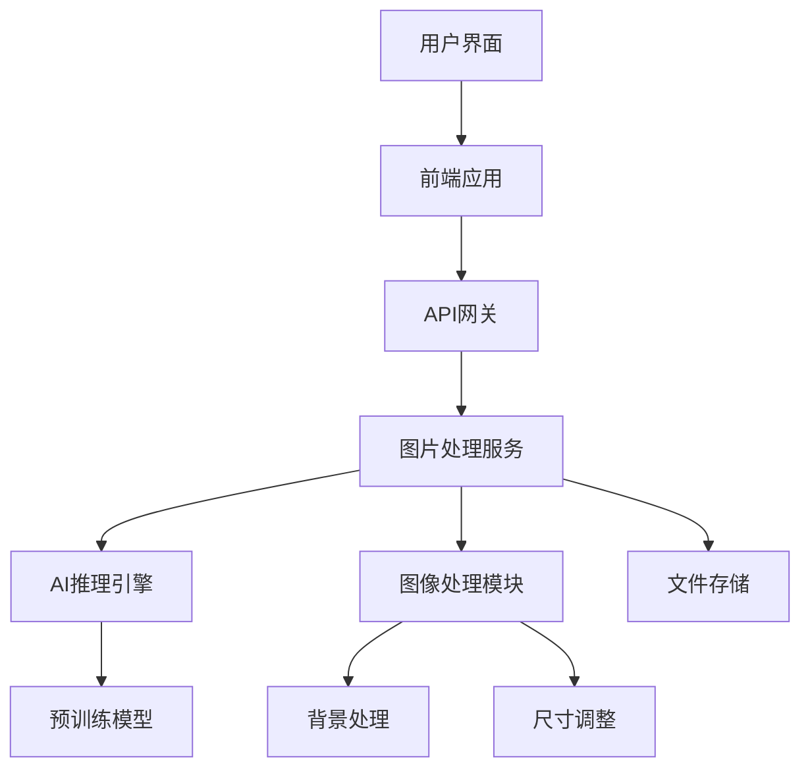

# 设计文档

## 概述

图片背景处理工具采用前后端分离的Web应用架构，结合AI图像分割技术实现自动抠图功能。系统使用预训练的深度学习模型进行产品主体识别，通过图像处理算法完成背景替换和尺寸标准化。

## 架构

### 系统架构图



### 技术栈

**前端**
- React.js + TypeScript
- Canvas API (图片预览和处理)
- Axios (HTTP客户端)
- Tailwind CSS (样式)

**后端**
- Node.js + Express.js
- Python FastAPI (AI推理服务)
- Sharp.js (图像处理)
- Multer (文件上传)

**AI模型**
- RMBG-1.4 或 U²-Net (背景移除)
- ONNX Runtime (模型推理)

## 组件和接口

### 前端组件

#### ImageUploader组件
```typescript
interface ImageUploaderProps {
  onImageSelect: (file: File) => void;
  maxFileSize: number;
  acceptedFormats: string[];
}
```

#### ImageProcessor组件
```typescript
interface ImageProcessorProps {
  originalImage: File;
  onProcessComplete: (processedImage: Blob) => void;
  onError: (error: string) => void;
}
```

#### ResultViewer组件
```typescript
interface ResultViewerProps {
  originalImage: string;
  processedImage: string;
  onDownload: () => void;
  onReset: () => void;
}
```

### API接口

#### 图片上传接口
```
POST /api/upload
Content-Type: multipart/form-data

Request:
- file: 图片文件 (JPG/PNG/WEBP, max 10MB)

Response:
{
  "success": true,
  "data": {
    "uploadId": "uuid",
    "originalUrl": "string",
    "metadata": {
      "width": number,
      "height": number,
      "format": string,
      "size": number
    }
  }
}
```

#### 图片处理接口
```
POST /api/process
Content-Type: application/json

Request:
{
  "uploadId": "string",
  "options": {
    "outputFormat": "jpg",
    "outputSize": {
      "width": 1200,
      "height": 1200
    }
  }
}

Response:
{
  "success": true,
  "data": {
    "processedUrl": "string",
    "processingTime": number,
    "confidence": number
  }
}
```

#### 处理状态查询接口
```
GET /api/process/status/{processId}

Response:
{
  "status": "processing" | "completed" | "failed",
  "progress": number,
  "estimatedTime": number,
  "error": string | null
}
```

### AI推理服务接口

#### 背景分割接口
```python
class BackgroundRemovalService:
    def remove_background(self, image: np.ndarray) -> Tuple[np.ndarray, np.ndarray]:
        """
        返回: (分割后的图片, 蒙版)
        """
        pass
    
    def get_confidence_score(self, mask: np.ndarray) -> float:
        """
        返回分割质量置信度
        """
        pass
```

## 数据模型

### 图片处理任务模型
```typescript
interface ProcessingTask {
  id: string;
  uploadId: string;
  status: 'pending' | 'processing' | 'completed' | 'failed';
  progress: number;
  createdAt: Date;
  completedAt?: Date;
  originalImage: {
    url: string;
    width: number;
    height: number;
    format: string;
    size: number;
  };
  processedImage?: {
    url: string;
    processingTime: number;
    confidence: number;
  };
  error?: string;
}
```

### 用户会话模型
```typescript
interface UserSession {
  sessionId: string;
  tasks: ProcessingTask[];
  createdAt: Date;
  lastActivity: Date;
}
```

## 错误处理

### 错误类型定义
```typescript
enum ErrorType {
  UPLOAD_ERROR = 'UPLOAD_ERROR',
  FILE_SIZE_ERROR = 'FILE_SIZE_ERROR',
  FORMAT_ERROR = 'FORMAT_ERROR',
  PROCESSING_ERROR = 'PROCESSING_ERROR',
  AI_MODEL_ERROR = 'AI_MODEL_ERROR',
  NETWORK_ERROR = 'NETWORK_ERROR'
}

interface AppError {
  type: ErrorType;
  message: string;
  code: number;
  details?: any;
}
```

### 错误处理策略

1. **文件上传错误**
   - 文件大小超限：显示具体限制信息
   - 格式不支持：列出支持的格式
   - 网络中断：提供重试机制

2. **AI处理错误**
   - 模型推理失败：回退到简单的边缘检测算法
   - 置信度过低：提示用户图片可能不适合自动处理
   - 内存不足：压缩图片后重试

3. **系统错误**
   - 服务不可用：显示维护提示
   - 超时错误：提供重新处理选项

## 测试策略

### 单元测试
- 图片处理函数测试
- API接口测试
- 组件渲染测试
- 错误处理测试

### 集成测试
- 完整的图片处理流程测试
- AI模型推理准确性测试
- 文件上传下载测试

### 性能测试
- 不同尺寸图片的处理时间测试
- 并发处理能力测试
- 内存使用情况监控

### 用户体验测试
- 不同类型产品图片的处理效果测试
- 边缘情况处理测试（模糊图片、复杂背景等）
- 移动端兼容性测试

## 性能优化

### 前端优化
- 图片预览使用Canvas进行压缩显示
- 实现图片懒加载
- 使用Web Workers处理大图片

### 后端优化
- 使用ONNX Runtime优化模型推理速度
- 实现图片处理队列，支持批量处理
- 添加Redis缓存常用处理结果

### AI模型优化
- 使用量化模型减少内存占用
- 实现模型预热，减少首次推理时间
- 根据图片尺寸动态调整模型输入分辨率

## 部署架构

### 开发环境
- 前端：Vite开发服务器
- 后端：Node.js + Python虚拟环境
- 存储：本地文件系统

### 生产环境
- 前端：Nginx静态文件服务
- 后端：PM2 + Gunicorn
- 存储：云存储服务（AWS S3/阿里云OSS）
- 负载均衡：Nginx反向代理
- 监控：日志收集和性能监控